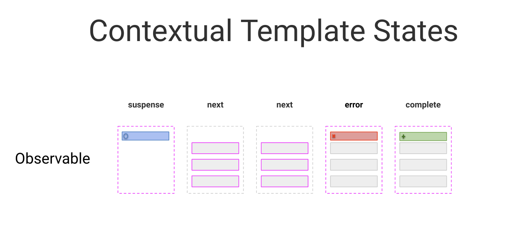

# Contextual Template States & Error Handling

In this exercise we will get to know different techniques to maintain contextual states provided by asynchronous data
structures in the template.



## Goal

The goal of this exercise is to learn how to make use of contextual template states in order to provide the users of your
application a better experience consuming it. On top of that you will learn how to implement contextual template states
in a very developer friendly way.

In this exercise we want to make use of the `rxLet` directive in order to provide our users contextual state information
derived from network request we perform to receive values for the users search input.

## Initial Suspense State

As a first step, let's handle the suspense state of the template (the loader).
The initial suspense state is already in place with the `*ngIf async hack`.

Start by introducing the `rxLet` Directive to your template in favor of `*ngIf`.   
You can import the `RxLet` from `'@rx-angular/template/let'`.

Be aware that you need to bind the `movie$` directly to the `rxLet` and get rid of the `async` pipe as well.

<details>
  <summary>Initial Suspense state</summary>

```html
<!--movie-search-page.component.html-->

<ng-container *rxLet="movies$; let movies; suspense: suspense">

  <!-- the template-->

</ng-container>

<ng-template #suspense>
  <div class="loader"></div>
</ng-template>


```

</details>

Great, serve the application and take a look if the initial suspense state is displayed correctly.
You probably want to open your `devtools => Network` tab and hit `disable cache`

```bash
  ng serve
```

## Suspense on new search: TemplateTrigger

We still miss a crucial feature for our `suspense` state to be perfect. When performing a new search, we want to show
the user again the `suspense` template.
For this to work, we need to proactively give the `rxLet` Directive a hint that it should switch to the `suspense`
state.

We do this by introducing a `suspense$: Subject<void>` in our `MovieSearchPageComponent`.

The `MovieSearchPageComponent` needs to call it's `next()` method whenever a new search is fired. This way we can switch to
the suspense template while we are waiting for the next result to be received.

Back in the template, use the `suspenseTrigger: suspense$` input property of the `rxLet` directive to bind the subject to
the directive.

<details>
  <summary>Solution: Template Trigger</summary>

```ts

readonly
suspense$ = new Subject<void>();

movies$ = this.activatedRoute.params.pipe(
  switchMap((params) => {
    // call the suspenseTrigger when getting new route params
    this.suspense$.next();
    return this.movieService.searchMovies(params.query);
  })
);

```

```html
<!--movie-search-page.component.html-->

<ng-container *rxLet="movies$; let movies; suspense: suspense; suspenseTrigger: suspense$">

</ng-container>
```

</details>

Great, serve the application and take a look if the initial suspense state as well as the intermediate suspense state are
displayed correctly. You probably want to open your `devtools => Network` tab and hit `disable cache`.

```bash
ng serve
```

## Error Template

The only thing left is having a dedicated `error` template.

Inside `MovieSearchPageComponent`s template, define an `ng-template` with the name `error`.
Assign it to the `rxLet` Directives `error:` input property.

If you want, you can use the `<fast-svg name="error" />` component for your error template.

<details>
  <summary>Solution: Error Template</summary>

```html
<!--movie-search-page.component.html-->

<ng-container *rxLet="movies$; let movies; error: error; suspense: suspense; suspenseTrigger: suspense$">

</ng-container>

<ng-template #error>
  <h2>An error occurred</h2>
  <div>
    <fast-svg name="error"/>
  </div>
</ng-template>
```

</details>

Great, serve the application and take a look if all the contextual states are
displayed correctly. You probably want to open your `devtools => Network` tab and hit `disable cache`.

For raising an error, navigate to the `MovieSearchComponent`, do a search, go to the `Network Tab` and select `Offline` in
the `throttling` dropdown selection.

Or, simply search for `throwError`, which is a special keyword that throws an error in the application.

```bash
ng serve
```

You should now see your error template after the error was thrown.

## Catch error and log it

The error is still uncaught inside your components state. Let's introduce a simple error logging mechanism whenever the
search raised an error. Use the `catchError` operator to catch the error.

In order to still be able to show the error template, you need to manually set it, as we did for the suspense template - with a template trigger.

<details>
  <summary>catchError & log</summary>

```ts

// movie-search-page.component.ts

readonly error$ = new Subject<void>();

movies$ = this.activatedRoute.params.pipe(
  switchMap((params) => {
    return this.movieService.searchMovies(params['query']);
  }),
  catchError(e => {
    this.error$.next();
    console.error('an error occurred when searching', e);
    return NEVER; // return NEVER, as we don't want to send data to the let directive
  })
);

```

Don't forget to bind the trigger in the template.

```html

<!-- movie-search-page.component.html -->

<ng-container *rxLet="movies$; let movies; suspense: loader; error: error; suspenseTrigger: suspense$; errorTrigger: error$">
</ng-container>


```

</details>

Cool, raise the error again and see if it gets logged into the console as well as the error template is shown.

## Retry before showing the error template

Sometimes processes or requests can be retried in order to still get a valid result.
Try to also make use of the `retry` operator so that your failed request is repeated twice before showing the actual error template.

Play around with different configurations, you probably want to use `delay` as well as `count`.

<details>
  <summary>retry before giving up</summary>

```ts

// movie-search-page.component.ts

import { retry } from 'rxjs';


movies$ = this.activatedRoute.params.pipe(
  switchMap((params) => {
    return this.movieService.searchMovies(params['query']);
  }),
  retry({ delay: 1000, count: 2 }),
  catchError(e => {
    this.error$.next();
    console.error('an error occurred when searching', e);
    return NEVER; // return NEVER, as we don't want to send data to the let directive
  })
);

```

## Restore Functionality on error

You have probably noticed that search is not usable after an error occurred. This is because an Observable cannot recover from
an error state on its own. It needs manual assistance in order to reset the observable.

The only actual option we have is to give the stream a replacement observable to continue. Right now, our replacement stream is `NEVER`.

Let's change that and instead of returning `NEVER` we need to return our original stream again.

This will be a tricky one, as the `activatedRoute.params` is a `BehaviorSubject`, thus always emitting a value on subscription.
You will need to find a way to not run into an infinite loop, so be careful :)

<details>
  <summary>restore functionality on catchError -> INFINITE LOOP</summary>

> Be careful, you end up in an infinite loop with this

```ts

// movie-search-page.component.ts

movies$ = this.activatedRoute.params.pipe(
  switchMap((params) => {
    this.supsense$.next();
    return this.movieService.searchMovies(params['query']);
  }),
  retry({ delay: 1000, count: 2 }),
  catchError(e => {
    this.error$.next();
    console.error('an error occurred when searching', e);
    return this.movies$; // we return the stream again to keep on listening to activatedRoute params and do the search
  })
);

```

</details>

In order to fix that issue, you can create a function that creates the search movies stream. As a parameter it should take
a variable that indicates if you want to skip the first result of the `params` observable or not.
Initially you want to have it repeat the latest value, on consequent calls you don't want that.

Use the `skip` operator in order to configure if you like skip the first emission or not. On `catchError` you can
recursively call the observable creation function again instead of returning a hot stream.

<details>
  <summary>restore functionality on catchError -> INFINITE LOOP</summary>

> Be careful, you end up in an infinite loop with this

```ts

// movie-search-page.component.ts

private searchMovies = (hot = true) => {
  return this.activatedRoute.params.pipe(
    skip(hot ? 0 : 1),
    switchMap((params) => {
      this.suspense$.next();
      return this.movieService.searchMovies(params['query']);
    }),
    retry({ count: 2, delay: 1000 }),
    catchError(e => {
      this.error$.next();
      console.error('an error occurred when searching', e);
      return this.searchMovies(false);
    })
  );
}

movies$ = this.searchMovies();

```

</details>

Nice job, go ahead and repeat the process from before. Raise the error and see if the functionality is still there by searching for something else
after the error was thrown.

