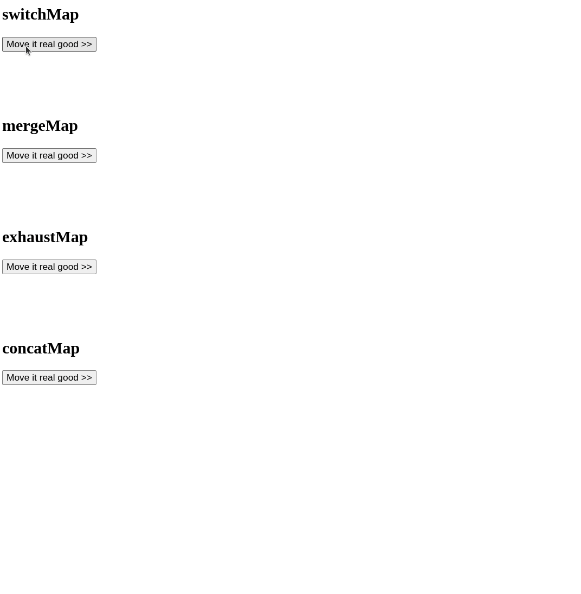

# Rate Limiting Exercise

# Goal

The goal of this exercise is to apply your knowledge about the JavaScript event loop and use rxjs tools to implement asynchronous operations.

## event coalescing: debounce search input

In this part we want to make use of the rate limiting operator `debounceTime` in order to prevent over-fetching of our APIs.
First, investigate the current state. Open your application and navigate to the `/my-movies` route. You'll find a search input box there.
Open your devtools network tab and filter for `xhr` requests. Go ahead and perform a search.

You should notice that a request is fired per keydown event. This is potentially harmful, especially in performance critical environments
or cases where API calls are charged.

Your task is to implement a solution that `coalesces` all input events together until a certain amount of time has passed to fire only
1 search request every x seconds.

The component you need to touch is the `MovieSearchControlComponent` in `/app/movie/movie-search-control/movie-search-control.component.ts`.


<details>
  <summary>MovieSearchControlComponent input debouncing</summary>

```ts
// movie-search-control.component.ts


movies$ = this.searchTerm$.pipe(
    debounceTime(200),
    switchMap((term) =>
        term ? this.movieService.searchMovies(term) : of(null)
    )
);

```

</details>

Good job! Open your application, repeat the process from before and observe your network tab. You should see less request being sent to the API.
You can play around with different timings to find something that is suitable for your needs :).

## animate higher order observables



Implement the code that moves around the cart image for the different flattening operators.
The skeleton is already implemented and ready to go, you just need to fill the gaps: https://stackblitz.com/edit/rxjs-flattening-operators-example-dqjjm3?file=index.ts

Your function should change the created boxes `style.left` or `style.translate - transformX` value in order
to move it around.

It should move the box from left to right in 250ms. From position 0 to position 250px.
As you are doing DOM animations, you might want to use the `animationFrameScheduler`.

<details>
  <summary>Solution</summary>

```ts

function createAndAnimateBox$(container: HTMLElement) {
  return new Observable(subscriber => {
    const box = createBox();
    container.appendChild(box);
    const sub = interval(0, animationFrameScheduler)
      .pipe(
        take(250),
        map(v => `${v}px`),
        tap(left => (box.style.left = left))
      )
      .subscribe(subscriber);
    return () => {
      sub.unsubscribe();
      container.removeChild(box);
    };
  });
}

```

</details>
